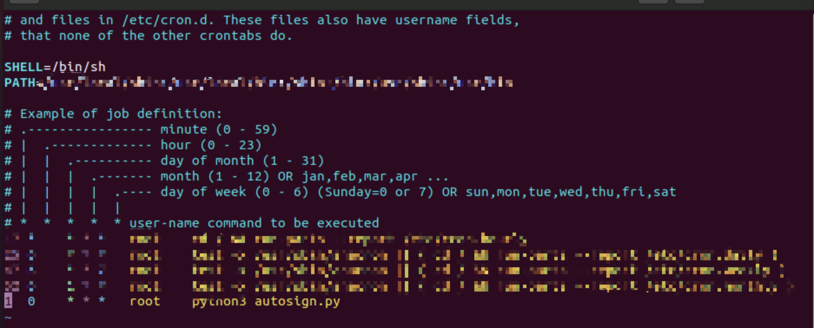

## README
# Step 1: Set up Selenium environment and drive Chrome browser
Mac:
https://zhuanlan.zhihu.com/p/112406390
Windows:
https://www.cnblogs.com/wilson-5133/p/10717768.html

# Step 2: Open autoSignIn.py and change your own username and password

# Step 3: Run autoSignIn.py in cmd or terminal

